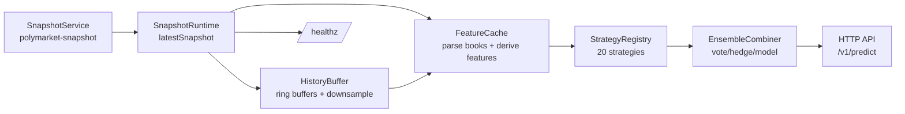

# Diseño analítico de 20 estrategias para predecir UP/DOWN a 30 segundos usando únicamente polymarket-snapshot

## Resumen ejecutivo

Este documento especifica un conjunto de **20 estrategias de predicción** (diversas y complementarias) para estimar, en el instante **T**, si el **midprice** del token **UP** en un mercado “Up or Down” de criptomonedas en entity["company","Polymarket","prediction market platform"] será **mayor en T+30s** que en T (salida `direction ∈ {UP, DOWN}`) y con **confianza numérica** `confidence ∈ [0,1]`. El diseño se ciñe estrictamente a los datos disponibles en el stream de snapshots de `@sha3/polymarket-snapshot`, que emite un **objeto plano** (`snake_case`) con campos de **spot crypto** (por asset y proveedor) y campos del **mercado Polymarket** (por asset y ventana 5m/15m). citeturn10view0turn10view2turn10view3

La solución propuesta está pensada para que **Codex 5.4** implemente cada estrategia como un servicio HTTP (o como “strategy modules” invocables vía HTTP), con:

- **Definiciones compartidas** (parsing de order books, cálculo de midprice con fallback, métricas de spread/profundidad/imbalance, checks de frescura vía `event_ts`, buffer histórico y caché de features). citeturn10view2turn7view0turn11view0turn13view0  
- **20 estrategias** agrupadas por tipo de señal: solo Polymarket (microestructura y dinámica de probabilidad), solo spot (precio y libro), híbridas (spot↔token, barrera `price_to_beat`, timing), meta/ensemble y un **modelo supervisado online** (estrategia 20). citeturn10view3turn12view4turn5view0  
- **API HTTP** con esquemas, endpoint de salud, y salida con “debug” por estrategia para observabilidad.

---

## Fuentes y modelo de datos disponible

### Qué entrega polymarket-snapshot y cómo se nombran los campos

`@sha3/polymarket-snapshot` expone `SnapshotService`, que mantiene un runtime y **emite snapshots planos** (objeto único) adecuados para persistir en una tabla “wide” (p. ej. en entity["organization","ClickHouse","columnar database"]). Cada snapshot incluye `generated_at` y un conjunto de columnas `snake_case` tipadas como `number | string | null`. citeturn10view0turn10view2turn7view0

**Campos spot (crypto) por asset** (`btc_*`, `eth_*`, `sol_*`, `xrp_*`), por proveedor:

- `{{asset}}_binance_price`, `{{asset}}_binance_order_book_json`, `{{asset}}_binance_event_ts`  
- `{{asset}}_coinbase_price`, `{{asset}}_coinbase_order_book_json`, `{{asset}}_coinbase_event_ts`  
- `{{asset}}_kraken_price`, `{{asset}}_kraken_order_book_json`, `{{asset}}_kraken_event_ts`  
- `{{asset}}_okx_price`, `{{asset}}_okx_order_book_json`, `{{asset}}_okx_event_ts`  
- `{{asset}}_chainlink_price`, `{{asset}}_chainlink_event_ts` (sin order book) citeturn10view2turn7view0turn11view0  

Los proveedores por defecto son entity["company","Binance","crypto exchange"], entity["company","Coinbase","crypto exchange"], entity["company","Kraken","crypto exchange"], entity["company","OKX","crypto exchange"] y entity["company","Chainlink","oracle network"] como feed de referencia. El código aplica explícitamente order books solo a proveedores “no-chainlink”. citeturn10view2turn11view0turn9view1  

**Campos de mercado** por asset y ventana (`{{asset}}_{{window}}_*`), solo si el snapshot cae **dentro** del intervalo del mercado activo:

- `{{asset}}_{{window}}_slug`
- `{{asset}}_{{window}}_market_start`, `{{asset}}_{{window}}_market_end` (ISO timestamps)
- `{{asset}}_{{window}}_price_to_beat`
- `{{asset}}_{{window}}_up_asset_id`, `..._up_price`, `..._up_order_book_json`, `..._up_event_ts`
- `{{asset}}_{{window}}_down_asset_id`, `..._down_price`, `..._down_order_book_json`, `..._down_event_ts` citeturn10view3turn7view0turn11view1  

El runtime **omite** columnas de mercado-ventana cuando `generated_at` está fuera del intervalo del mercado, y además calcula “is live market” comparando `generated_at` con `market_start`/`market_end`. citeturn10view0turn11view1

### Configuración relevante (intervalos, assets, ventanas y delays)

Por defecto, el paquete soporta `assets = ["btc","eth","sol","xrp"]` y `windows = ["5m","15m"]`, con `snapshotIntervalMs` por defecto 500ms y valores permitidos `[100, 200, 500, 1000]`. citeturn5view0turn10view3  

Además, hay delays explícitos para `price_to_beat`:

- `DEFAULT_PRICE_TO_BEAT_INITIAL_DELAY_MS = 10_000`  
- `DEFAULT_PRICE_TO_BEAT_RETRY_INTERVAL_MS = 5_000`  
- `MARKET_BOUNDARY_DELAY_MS = 250`  
- `MARKET_ACTIVATION_RETRY_INTERVAL_MS = 1_000` citeturn5view0turn10view3  

Implicación práctica: estrategias que dependan de `price_to_beat` deben tolerar **null** durante los primeros segundos tras activación y aplicar “quality dampers”.

### Semántica de order books y del “midpoint” en Polymarket

La documentación oficial de Polymarket define el order book como arrays `bids` y `asks` con niveles `{price, size}`, donde `bids` está ordenado por precio descendente y `asks` por precio ascendente. citeturn13view0turn12view1  

El **midpoint** se define como el promedio de la mejor bid y la mejor ask, y es el precio mostrado como “probabilidad implícita”; si el spread es mayor de **$0.10**, Polymarket muestra el **last traded price** en lugar del midpoint. citeturn13view1turn12view3  

En `polymarket-snapshot`, los order books (`*_order_book_json`) se serializan con `JSON.stringify` y, para outcomes, se clonan explícitamente como `{asks: ..., bids: ...}` antes de serializar. citeturn9view0turn9view2turn11view1  

### Contexto del mercado “Up or Down” y rol de Chainlink

En los mercados “Up or Down” de 15 minutos (y análogos), el market resolve a “Up” si el precio al final del intervalo es ≥ al precio al inicio, “Down” en caso contrario, y la fuente de resolución es el stream de Chainlink BTC/USD (para BTC). citeturn12view4  

Esto es crítico para estrategias basadas en `price_to_beat`, `market_end` y `chainlink_price/event_ts`.

---

## Utilidades compartidas, definiciones y tablas de features

### Reglas de parsing de order_book_json

**Contrato recomendado** (robusto):

- `parseOrderBook(jsonStr)`:
  - si `jsonStr == null` ⇒ return `null`
  - `obj = JSON.parse(jsonStr)`
  - localizar `bids` y `asks` como arrays (si no existen ⇒ null)
  - normalizar niveles:
    - `price = Number(level.price ?? level.px ?? ...)`
    - `size = Number(level.size ?? level.qty ?? ...)`
  - filtrar NaNs, tamaños ≤ 0
  - si no garantiza orden, ordenar:
    - bids por `price desc`
    - asks por `price asc` citeturn13view0turn9view2  

Nota: En Polymarket, el shape `{price,size}` está documentado. En spot, el snapshot proviene de feeds internos y se serializa conservando `asks`/`bids`, pero el nombre exacto de campos por nivel puede variar; por ello el parser debe ser tolerante. citeturn11view0turn9view2  

### Midprice target y fallback

**Midprice(UP) en t**:

1. Si `{{asset}}_{{window}}_up_order_book_json` parsea a un libro con al menos 1 bid y 1 ask:
   - `bestBid = bids[0].price`
   - `bestAsk = asks[0].price`
   - `mid = (bestBid + bestAsk)/2` (midpoint) citeturn13view1turn13view0  
2. Si no hay libro válido ⇒ **fallback** `mid = {{asset}}_{{window}}_up_price` (requisito). El `up_price` se setea cuando llega un evento `type === "price"`. citeturn11view1turn7view0  

### Label consistente para entrenamiento/validación

Definimos el label binario a 30s:

- `y(t) = 1` si `mid_up(t+30s) > mid_up(t) + ε`
- `y(t) = 0` en caso contrario  
- `ε` (tunable) por defecto `ε = 0.001` para ignorar micro-ruido.

La salida final del servicio será:

- `direction = (y_hat==1 ? "UP" : "DOWN")`
- `confidence ∈ [0,1]` (ver mapeos).

### Freshness checks y gates de calidad (data-quality dampers)

Cada snapshot incluye timestamps `*_event_ts` para spot y para outcomes UP/DOWN. citeturn7view0turn10view2turn11view1  

Definiciones recomendadas (tunable):

- `age_ms(field) = generated_at - field_event_ts`
- `isFresh(ms) = (ms != null && ms <= MAX_AGE_MS)`
  - `MAX_AGE_MS_token = 3000`
  - `MAX_AGE_MS_spot = 3000`
  - `MAX_AGE_MS_chainlink = 5000` (Chainlink puede actualizar menos frecuente)
- `hasLiveMarket = ({{asset}}_{{window}}_slug != null)` ya que fuera de mercado se setea `slug=null`. citeturn11view1turn10view3  

Métricas de liquidez (por token):

- `spread = bestAsk - bestBid` (si hay libro) citeturn13view1  
- `wideSpreadFlag = (spread > 0.10)` (alineado con criterio de UI/last-trade). citeturn13view1turn12view3  
- `depthTopK = Σ size(bids[0:K]) + Σ size(asks[0:K])` con `K=5` por defecto.

**Damper global** `D ∈ [0,1]` (por estrategia, mismo patrón):

- `D_market = hasLiveMarket ? 1 : 0`
- `D_fresh = clamp(1 - age_ms/MAX_AGE_MS, 0, 1)` (usar el peor entre campos críticos)
- `D_liquidity` basado en spread y depth (p.ej. 1 si spread<=0.03 y depthTopK>=minDepth; 0.3 si wideSpreadFlag; etc.)
- `D_total = D_market * D_fresh * D_liquidity`

### Mapeo estándar score→confidence

Cada estrategia produce un **raw score** `s` (real, signo indica UP vs DOWN). Mapeo:

- `p_raw = sigmoid(k * s)` con `k` tunable (default `k=2.0`)
- `confidence_raw = max(p_raw, 1 - p_raw)`
- `confidence = 0.5 + (confidence_raw - 0.5) * D_total`

Esto asegura que, con mala calidad (`D_total≈0`), la confianza se acerca a 0.5 aunque haya score fuerte.

### Tamaño del history buffer y caching

Dado que `snapshotIntervalMs` puede ser 100–1000ms, almacenar “últimos minutos” debe definirse por tiempo o por número de muestras. El paquete permite intervalos `[100,200,500,1000]` ms, con default 500ms. citeturn5view0turn10view3  

Recomendación (tunable):

- `H_short = 120s` con downsample a 1s para regresiones/correlaciones.
- `H_long = 600s` para volatilidad y “regime detection”.
- Guardar:
  - snapshots crudos mínimos (precios, timestamps, libros parseados top-K)
  - features cacheadas por snapshot: bid/ask/mid/spread/depth/imbalance, hashes top-K.

### Tabla de campos→features derivados (usados transversalmente)

| Snapshot key (plantilla) | Tipo | Uso principal | Features derivados típicos |
|---|---:|---|---|
| `generated_at` | number | reloj del snapshot | latencia, alineación temporal, `t_remaining` |
| `{{A}}_{{W}}_slug` | string/null | “market live” | `hasLiveMarket` |
| `{{A}}_{{W}}_market_start/end` | string/null | timing de ventana | `t_elapsed`, `t_remaining`, `phase` |
| `{{A}}_{{W}}_price_to_beat` | number/null | barrera (strike) | `delta_to_beat`, `z_barrier` |
| `{{A}}_{{W}}_up_price` | number/null | fallback midprice | retorno 30s, momentum |
| `{{A}}_{{W}}_up_order_book_json` | json/null | microestructura UP | bestBid/Ask, mid, spread, depth, imbalance, walls, churn |
| `{{A}}_{{W}}_up_event_ts` | number/null | frescura UP | `age_up_ms`, update rate |
| `{{A}}_{{W}}_down_*` | … | microestructura DOWN | consistencia UP+DOWN, spreads relativos |
| `{{A}}_{binance,coinbase,kraken,okx}_price` | number/null | spot multi-venue | consenso, momentum, dispersión |
| `{{A}}_{binance,coinbase,kraken,okx}_order_book_json` | json/null | spot microestructura | microprice, slippage proxy, imbalance |
| `{{A}}_{binance,coinbase,kraken,okx}_event_ts` | number/null | frescura spot | `age_spot_ms`, lead/lag |
| `{{A}}_chainlink_price/event_ts` | number/null | ancla de resolución | basis spot↔oracle, staleness oracle |

Estos campos y su existencia por defecto están documentados en el README/tipos del repositorio. citeturn10view2turn10view3turn7view0turn5view0  

---

## Estrategias de predicción

### Tabla-resumen de las 20 estrategias

| ID | Estrategia | Datos | Coste | Sensible a latencia | Señal primaria |
|---:|---|---|---|---|---|
| 1 | Momentum EWMA del mid UP | Polymarket | Bajo | Alta | tendencia corta |
| 2 | Microprice L1 UP vs DOWN | Polymarket | Bajo | Alta | imbalance top-of-book |
| 3 | Imbalance multi-nivel en banda | Polymarket | Medio | Media | profundidad alrededor del mid |
| 4 | Proximidad a “walls” | Polymarket | Medio | Media | barreras de liquidez |
| 5 | Churn/cancel proxy en top-K | Polymarket | Medio | Alta | rotación de libro |
| 6 | Consistencia UP+DOWN (no-arb) | Polymarket | Bajo | Media | corrección de mispricing |
| 7 | Compresión de spread + momentum | Polymarket | Bajo | Alta | mejora de liquidez |
| 8 | Timing + `price_to_beat` con Chainlink | Híbrida (oracle+market) | Bajo | Media | dinámica de barrera |
| 9 | Momentum consenso multi-exchange | Spot | Bajo | Media | retorno spot robusto |
| 10 | Micropressure spot (microprice) | Spot | Medio | Alta | imbalance spot |
| 11 | Dispersión cross-venue + confirmación | Spot | Medio | Media | shock real vs ruido |
| 12 | Breakout por régimen de volatilidad | Spot | Medio | Media | vol-cluster + drift |
| 13 | Slippage-asimétrico spot top-K | Spot | Medio | Media | slope del libro |
| 14 | Staleness Chainlink + basis spot | Híbrida | Bajo | Media | catch-up oracle |
| 15 | Probabilidad “teórica” vs token implícito | Híbrida | Medio | Baja | token↔barrera↔vol |
| 16 | Gap de frescura spot→token | Híbrida | Bajo | Alta | lag de actualización |
| 17 | Regime switching por tiempo+liquidez | Híbrida | Medio | Media | mixture-of-experts |
| 18 | Liquidity shock & fade | Híbrida | Medio | Alta | mean reversion en dislocaciones |
| 19 | Ensemble Hedge por performance reciente | Meta | Alto | Baja | aprendizaje de pesos |
| 20 | Modelo supervisado online (logreg SGD) | Aprendido | Alto | Media | prob calibrada |

A continuación se especifica cada estrategia con: campos requeridos, pasos, regla, confianza, gates, coste y diferenciación.

---

### Estrategia uno: Momentum EWMA del midprice UP

**Idea:** el midprice del token UP tiende a continuar su drift en horizontes ultra-cortos cuando el libro está activo y fresco.

**Campos requeridos (templates):**  
`generated_at`, `{{A}}_{{W}}_slug`, `{{A}}_{{W}}_up_order_book_json`, `{{A}}_{{W}}_up_price`, `{{A}}_{{W}}_up_event_ts`. citeturn10view3turn7view0turn11view1  

**Pasos (pseudocódigo):**
```text
mid_t = midprice_up(snapshot)  // book midpoint else up_price
series = history.mid_up last L seconds (L=20s)
slope = EWMA(diff(series), alpha=0.3)  // promedio de increments 1s
vol = EWMA(|diff(series)|, alpha=0.3) + eps
score s = slope / vol
```

**Decisión:** `UP` si `s > 0`, si no `DOWN`.

**Confianza:** `p_raw = sigmoid(2.0*s)`; aplicar `D_total` (market live + frescura + liquidez).

**Gates:** `hasLiveMarket`, `age_up_ms ≤ 3s`, libro válido o `up_price` no-null.

**Coste:** Bajo (O(1) por snapshot, O(L) en update incremental).

**Diferencia:** baseline Polymarket-only; no usa spot ni DOWN.

---

### Estrategia dos: Microprice L1 UP vs DOWN (presión top-of-book)

**Idea:** el “microprice” (mid ponderado por tamaños bid/ask) del top-of-book anticipa el siguiente movimiento del mid.

**Campos:**  
`{{A}}_{{W}}_up_order_book_json`, `{{A}}_{{W}}_down_order_book_json`, `generated_at`, `{{A}}_{{W}}_slug`. citeturn10view3turn9view2turn13view0  

**Pasos:**
```text
for token in {UP, DOWN}:
  (pBid,qBid,pAsk,qAsk) = best_levels(tokenBook)
  mid = (pBid+pAsk)/2
  micro = (pAsk*qBid + pBid*qAsk) / (qBid+qAsk)
  pressure = micro - mid
score s = pressure_UP - pressure_DOWN
```

**Decisión:** `UP` si `s>0`.

**Confianza:** crece con `|s|` y con `(qBid+qAsk)`; penaliza spreads anchos (`spread>0.10`). citeturn13view1  

**Gates:** libros válidos en ambos tokens; si falta uno, degradar a `confidence≈0.55` o fallback a estrategia 1.

**Coste:** Bajo (O(1)).

**Diferencia:** microestructura estricta L1 y diferencial UP vs DOWN.

---

### Estrategia tres: Imbalance multi-nivel en banda alrededor del mid

**Idea:** el desequilibrio de profundidad en varios niveles cerca del mid refleja intención y puede predecir movimientos de 30s.

**Campos:**  
`{{A}}_{{W}}_up_order_book_json`, `{{A}}_{{W}}_down_order_book_json`, `generated_at`, `{{A}}_{{W}}_slug`. citeturn10view3turn9view2  

**Hyperparams:** `K=10` niveles o banda `±0.02` (tunable).

**Pasos:**
```text
imbalance(book):
  mid = midpoint(book)
  bidDepth = sum(size of bids with price >= mid - band)
  askDepth = sum(size of asks with price <= mid + band)
  return (bidDepth - askDepth) / (bidDepth + askDepth + eps)

s = imbalance(UP_book) - imbalance(DOWN_book)
```

**Decisión:** `UP` si `s>0`.

**Confianza:** `|s|` ponderado por profundidad total; `D_liquidity` alto si depthTopK grande.

**Gates:** si `depthTopK` bajo o spread ancho, reducir confianza.

**Coste:** Medio (O(K) por libro).

**Diferencia:** usa forma del libro cerca del mid, no solo L1.

---

### Estrategia cuatro: Proximidad a “walls” (soporte/resistencia discreta)

**Idea:** “paredes” (niveles con size grande) cercanas al precio bloquean avances y generan reversión o desaceleración en 30s.

**Campos:**  
`{{A}}_{{W}}_up_order_book_json`, `{{A}}_{{W}}_down_order_book_json`. citeturn9view2  

**Hyperparams:** `K=12` niveles; `ε=1e-6`.

**Pasos:**
```text
wall_score(book):
  mid = midpoint(book)
  bestWallsBid = max_K(bids by size) among first K
  bestWallsAsk = max_K(asks by size) among first K
  support = size_bid / (mid - price_bid + eps)
  resist  = size_ask / (price_ask - mid + eps)
  return support - resist

s = wall_score(UP_book) - wall_score(DOWN_book)
```

**Decisión:** `UP` si `s>0`.

**Confianza:** sube si existe wall muy grande y muy cercana (alto `size/dist`); cae si el libro es thin.

**Gates:** libro válido; si distancias <=0 (datos corruptos) ⇒ confianza 0.5.

**Coste:** Medio.

**Diferencia:** modela “bloqueos” locales (no puro imbalance).

---

### Estrategia cinco: Churn/cancel proxy en top-K (dinámica del libro)

**Idea:** sin eventos explícitos de cancelación, se infiere “order-flow” comparando snapshots: cambios rápidos de tamaños/niveles en top-K suelen preceder movimiento de precio.

**Campos:**  
`{{A}}_{{W}}_up_order_book_json`, `{{A}}_{{W}}_down_order_book_json`, `generated_at`, history buffer. citeturn9view2turn5view0  

**Hyperparams:** ventana churn `L=10s`, `K=10`.

**Pasos:**
```text
fingerprint(book) = hash(topK levels prices+sizes)   // hash propio
churn = count of changed levels OR sum(|Δsize|) across topK over last Ls
signed_flow = (ΔbidDepth - ΔaskDepth) over last Ls
s = signed_flow_UP - signed_flow_DOWN
confidence booster if churn is high and price starts moving
```

**Decisión:** `UP` si `s>0`.

**Confianza:** depende de magnitud y consistencia (misma señal en varias subventanas: 3s, 10s).

**Gates:** requiere history suficiente; si no, degradar.

**Coste:** Medio (O(K) por snapshot) + hashing.

**Diferencia:** explota **dinámica temporal del libro**, no foto estática.

---

### Estrategia seis: Consistencia UP+DOWN (mispricing “sum-to-one”)

**Idea:** en mercados binarios, los precios (probabilidades) tienden a complementariedad. Si `mid_up` difiere mucho de `1 - mid_down`, suele haber corrección en el corto plazo. La lógica de “prices = probabilities” y el uso del midpoint están documentados por Polymarket. citeturn12view3turn13view1turn12view2  

**Campos:**  
`{{A}}_{{W}}_up_order_book_json`, `{{A}}_{{W}}_down_order_book_json` (o fallback a `*_price`). citeturn10view3  

**Pasos:**
```text
midU = mid(UP) ; midD = mid(DOWN)
mispricing = (1 - midD) - midU
score s = mispricing
```

**Decisión:** `UP` si `s>0` (UP “barato” vs complemento → tenderá a subir).

**Confianza:** fuerte solo si spreads son estrechos (midpoint confiable). Penalizar `spread>0.10`. citeturn13view1  

**Gates:** si `wideSpreadFlag`, bajar confianza agresivamente.

**Coste:** Bajo.

**Diferencia:** explota **relación estructural** UP↔DOWN, no spot.

---

### Estrategia siete: Compresión de spread + momentum (calidad de precio)

**Idea:** cuando el spread cae y la liquidez mejora, el momentum reciente es más fiable; cuando spread se abre, es más probable “whipsaw”.

**Campos:**  
`{{A}}_{{W}}_up_order_book_json`, `{{A}}_{{W}}_up_price` (fallback), history. citeturn13view1turn10view3  

**Pasos:**
```text
mid_t = mid_up(t)
mom = mid_t - mid_up(t-10s)
spread_now = spread_up(t)
spread_old = spread_up(t-10s)
compression = spread_old - spread_now   // >0 => spread se cierra
s = mom * tanh(compression / spread_scale)
```

**Decisión:** signo de `s`.

**Confianza:** aumenta si `compression>0` y `spread_now` pequeño.

**Gates:** si spread no computable, degrade.

**Coste:** Bajo.

**Diferencia:** integra microestructura (spread) como “filtro de fiabilidad” del momentum.

---

### Estrategia ocho: Timing + price_to_beat con Chainlink (barrera anclada a resolución)

**Idea:** cerca del final de la ventana, el valor del UP token reacciona fuertemente a la posición del subyacente respecto a `price_to_beat`. Aquí se usa `chainlink_price` como ancla (y además la regla de resolución remite explícitamente a Chainlink). citeturn12view4turn10view2turn10view3  

**Campos:**  
`generated_at`, `{{A}}_{{W}}_market_end`, `{{A}}_{{W}}_price_to_beat`, `{{A}}_chainlink_price`, `{{A}}_chainlink_event_ts`, `{{A}}_{{W}}_up_order_book_json` (para evaluar reacción del token). citeturn10view3turn10view2turn5view0  

**Pasos:**
```text
tau = seconds(market_end - generated_at)
delta = (chainlink_price - price_to_beat) / price_to_beat
z = delta / sqrt(max(tau, 1))          // sensibilidad aumenta al acercarse al final
z_mom = z - z(t-10s)
score s = z_mom
```

**Decisión:** `UP` si `s>0`, `DOWN` si `s<0`.

**Confianza:** mayor si `tau < 120s` y chainlink es fresco; si `price_to_beat` null (posible por delay inicial), confidence≈0.5. citeturn5view0turn11view1  

**Gates:** requiere `hasLiveMarket`, `price_to_beat != null`, `chainlink_price != null`.

**Coste:** Bajo.

**Diferencia:** explota **timing del mercado** y la **barrera** explícita.

---

### Estrategia nueve: Momentum consenso multi-exchange (spot robusto)

**Idea:** un retorno spot robusto y confirmado por varias venues predice el movimiento del token UP en 30s (el mercado reacciona al spot en tiempo real).

**Campos:**  
`{{A}}_{binance,coinbase,kraken,okx}_price`, `*_event_ts`, `generated_at`. citeturn10view2turn7view0  

**Pasos:**
```text
S(t) = median of available venue prices (weighted by freshness)
r5  = (S(t) - S(t-5s)) / S(t-5s)
r15 = (S(t) - S(t-15s)) / S(t-15s)
s = 0.7*r5 + 0.3*r15
```

**Decisión:** `UP` si `s>0`.

**Confianza:** crece si (a) muchas venues frescas, (b) baja dispersión entre venues, (c) |s| grande.

**Gates:** mínimo 2 venues con precio fresco.

**Coste:** Bajo.

**Diferencia:** solo spot (sin Polymarket books).

---

### Estrategia diez: Micropressure spot por microprice (order book del subyacente)

**Idea:** imbalance L1 del spot book es un predictor de drift spot inmediato, que se transmite al token.

**Campos:**  
`{{A}}_{binance,coinbase,kraken,okx}_order_book_json`, `*_event_ts`, `generated_at`. citeturn10view2turn11view0  

**Pasos:**
```text
for each venue with valid book:
  pressure_v = microprice(book_v) - midpoint(book_v)
combined = weighted_avg(pressure_v, weights=freshness)
score s = combined
```

**Decisión:** `UP` si `s>0`.

**Confianza:** mayor si varias venues concuerdan en el signo; penalizar si libros faltan o están stale.

**Gates:** al menos 1 venue con libro válido (ideal ≥2).

**Coste:** Medio (parsing+top-of-book por venue).

**Diferencia:** microestructura spot explícita (no precios).

---

### Estrategia once: Dispersión cross-venue + confirmación (shock real vs ruido)

**Idea:** un movimiento spot “real” suele reflejarse en varias venues (dispersión baja). Si solo una venue se mueve y la dispersión sube, predomina reversion a consenso.

**Campos:**  
`{{A}}_{binance,coinbase,kraken,okx}_price`, history. citeturn10view2  

**Pasos:**
```text
prices = {p_v}
median = median(prices)
disp = (max(prices) - min(prices)) / median
move = median(t) - median(t-5s)
if disp increased sharply and only one venue deviates:
   s = -move   // fade el movimiento
else:
   s = move    // follow el consenso
```

**Decisión:** signo de `s`.

**Confianza:** alta si hay confirmación multi-venue (disp baja) o si detectas outlier muy claro.

**Gates:** ≥3 venues con precio.

**Coste:** Medio.

**Diferencia:** clasifica “ruido de venue” vs “movimiento global”.

---

### Estrategia doce: Breakout por régimen de volatilidad (vol-clustering)

**Idea:** cuando la volatilidad reciente se dispara respecto a su baseline, el mercado entra en régimen de alta actividad donde el drift puede persistir 30s; si vol alta sin drift claro, la confianza baja.

**Campos:**  
`{{A}}_*_price` (consenso), history. citeturn10view2  

**Pasos:**
```text
S = robust spot median
ret1s = returns(S, 1s)
vol_fast = std(ret1s over 15s)
vol_slow = std(ret1s over 120s) + eps
vol_ratio = vol_fast / vol_slow
mom = (S(t) - S(t-10s))/S(t-10s)

if vol_ratio > 2.0 and |mom| > mom_min:
   s = mom * vol_ratio
else:
   s = mom
```

**Decisión:** signo de `s`.

**Confianza:** aumenta con `vol_ratio` y `|mom|`, pero penaliza si vol alta y mom≈0.

**Gates:** history suficiente (≥120s) o degrade.

**Coste:** Medio (stats rolling).

**Diferencia:** régimen de volatilidad explícito (no microestructura).

---

### Estrategia trece: Slippage-asimétrico spot (slope del libro top-K)

**Idea:** aproximar la “pendiente” del order book (resistencia) simulando el coste de caminar K niveles. Si comprar “cuesta poco” vs vender “cuesta mucho”, el drift tiende a UP.

**Campos:**  
`{{A}}_binance_order_book_json` (o venue seleccionada), y opcionalmente otras para robustez. citeturn10view2turn11view0  

**Hyperparams:** `K=10`, `Q=notional` proxy (p.ej. sumar tamaños hasta alcanzar Q).

**Pasos:**
```text
mid = midpoint(book)
avg_buy_px = vwap(asks until cumSize >= Q)
avg_sell_px = vwap(bids until cumSize >= Q)
buy_slip  = (avg_buy_px - mid)
sell_slip = (mid - avg_sell_px)
s = sell_slip - buy_slip   // si buy_slip < sell_slip => s>0 => UP
```

**Decisión:** `UP` si `s>0`.

**Confianza:** crece con asimetría y con profundidad suficiente.

**Gates:** libro válido; Q alcanzable en ambos lados (si no, degrade).

**Coste:** Medio.

**Diferencia:** usa forma de libro (slippage proxy), no L1.

---

### Estrategia catorce: Staleness de Chainlink + basis spot↔oracle (catch-up)

**Idea:** cuando Chainlink está “stale” y spot se separa, al actualizar Chainlink suele haber ajuste; el token se alinea al ancla de resolución (Chainlink). La regla del mercado remite explícitamente a Chainlink. citeturn12view4turn10view2turn11view0  

**Campos:**  
`{{A}}_chainlink_price`, `{{A}}_chainlink_event_ts`, spot consenso `{{A}}_*_price`, `generated_at`. citeturn10view2turn11view0  

**Pasos:**
```text
S = robust spot median
basis = (S - chainlink_price) / chainlink_price
stale_s = (generated_at - chainlink_event_ts)/1000
s = basis * clamp(stale_s / 5.0, 0, 1)   // más staleness => más peso al basis
```

**Decisión:** signo de `s`.

**Confianza:** sube con |basis| y staleness; penaliza si chainlink no está stale (señal débil).

**Gates:** chainlink_price != null; al menos 2 venues spot disponibles.

**Coste:** Bajo.

**Diferencia:** explota asincronía oracle↔spot.

---

### Estrategia quince: Probabilidad “teórica” (barrera+vol) vs prob implícita del token

**Idea:** el precio UP se interpreta como probabilidad (midpoint) en Polymarket. Comparar esa prob implícita con una probabilidad estimada desde spot vs `price_to_beat`, volatilidad y tiempo restante sugiere la dirección del ajuste del token. citeturn13view1turn12view3turn10view3  

**Campos:**  
`{{A}}_{{W}}_price_to_beat`, `{{A}}_{{W}}_market_end`, `generated_at`, `{{A}}_*_price` (spot), `{{A}}_{{W}}_up_order_book_json` (para mid token). citeturn10view3turn5view0  

**Pasos:**
```text
tau = seconds(market_end - generated_at)
S = robust spot median
delta = (S - price_to_beat)/price_to_beat
sigma = realized_vol(spot returns over 120s)
z = delta / (sigma*sqrt(max(tau,1)) + eps)
p_hat = sigmoid(z)                // prob "teórica" Up al final
p_token = mid_up                  // prob implícita del token
s = p_hat - p_token               // si p_hat>p_token, UP debería subir
```

**Decisión:** `UP` si `s>0`.

**Confianza:** alta si `tau` es relativamente pequeño (endgame) y sigma estimada estable; penalizar si `price_to_beat` null.

**Gates:** `price_to_beat != null`, history≥120s.

**Coste:** Medio.

**Diferencia:** conecta explícitamente token-probabilidad con variables estructurales del mercado.

---

### Estrategia dieciséis: Gap de frescura spot→token (lag de actualización)

**Idea:** si spot se mueve pero el token no ha recibido updates (event_ts viejo), el token tiende a “ponerse al día”.

**Campos:**  
`generated_at`, spot `{{A}}_*_event_ts` y `{{A}}_*_price`, token `{{A}}_{{W}}_up_event_ts` + mid/up_price. citeturn10view2turn10view3turn11view1  

**Pasos:**
```text
spot_move = S(t) - S(t-5s)
age_token = generated_at - up_event_ts
age_spot  = generated_at - max(venue_event_ts)
gap = clamp((age_token - age_spot) / 3000, 0, 1)
s = sign(spot_move) * |spot_move| * gap
```

**Decisión:** signo de `s`.

**Confianza:** sube cuando token va claramente “por detrás” y movimiento spot es significativo.

**Gates:** requiere `up_event_ts` no-null y al menos 1 venue spot fresca.

**Coste:** Bajo.

**Diferencia:** usa timestamps como señal predictiva (no precios solo).

---

### Estrategia diecisiete: Regime switching por tiempo restante y liquidez (mixture-of-experts)

**Idea:** el mercado cambia de comportamiento según fase (inicio vs final) y liquidez (spread). Seleccionar experto base dinámicamente.

**Campos:**  
`{{A}}_{{W}}_market_end`, `generated_at`, `{{A}}_{{W}}_up_order_book_json`, `{{A}}_*_price`, `{{A}}_{{W}}_price_to_beat`, etc. citeturn10view3turn13view1turn5view0  

**Pasos:**
```text
tau = seconds(market_end - generated_at)
spread_up = spread(token UP)
if tau < 120s and price_to_beat!=null:
   use Strategy 15 (barrier+vol) => (dir,conf,score)
else if spread_up <= 0.03:
   use Strategy 2 or 3 (microstructure) 
else:
   use Strategy 9 (spot consensus)
final = selected output, with gating reporting
```

**Decisión:** la del experto activo.

**Confianza:** confianza del experto * `D_total` del régimen.

**Gates:** si falta data para experto seleccionado, fallback a siguiente.

**Coste:** Medio.

**Diferencia:** “control policy” explícita; reduce overfitting de una sola señal.

---

### Estrategia dieciocho: Liquidity shock & fade (dislocaciones rápidas)

**Idea:** shocks de liquidez (spread se dispara, depth colapsa, walls aparecen/desaparecen) a menudo producen **reversión** en 30s, salvo que spot confirme la dirección.

**Campos:**  
Polymarket: `{{A}}_{{W}}_up_order_book_json`, history; Spot: `{{A}}_*_price`. citeturn10view3turn10view2turn13view1  

**Hyperparams:** baseline 60s.

**Pasos:**
```text
spread_now, depth_now, mid_now
spread_ref = median(spread over 60s)
depth_ref  = median(depth over 60s)
shock = (spread_now/spread_ref > 2.0) AND (depth_now/depth_ref < 0.5)

move = mid_now - mid(t-5s)
spot_move = S(t) - S(t-5s)

if shock and sign(move) != sign(spot_move):   // dislocación no confirmada
    s = -move   // fade
else:
    s = move    // follow
```

**Decisión:** signo de `s`.

**Confianza:** alta solo si shock fuerte y no confirmado por spot; si spot confirma, confianza moderada.

**Gates:** requiere history suficiente para baseline; si no, degrade.

**Coste:** Medio.

**Diferencia:** diseñado para capturar reversión tras shocks de microestructura.

---

### Estrategia diecinueve: Ensemble Hedge por performance reciente (meta-estrategia)

**Idea:** combinar varias estrategias base ponderando según su performance reciente en el objetivo “mid_up sube en 30s”. Esto es un learning-to-weight online (tipo Hedge/Exponentially Weighted Average Forecaster).

**Campos:**  
Salidas de estrategias base + labels `y(t)` cuando se materialicen (requiere history y cola de 30s).

**Pasos:**
```text
initialize weights w_i = 1/N
on each time t where label y(t) becomes known:
  for each strategy i:
    pred_i = p_i(t)  // prob UP (derivada de score/conf)
    loss_i = logloss(y(t), pred_i)
    w_i = w_i * exp(-eta * loss_i)
  normalize w

predict at time t:
  p_ens = sum(w_i * p_i(t))
  direction = UP if p_ens>0.5 else DOWN
  confidence = max(p_ens, 1-p_ens) * D_total_ensemble
```

**Confianza:** el propio `p_ens` (calibrable) + dampers por calidad de datos.

**Gates:** mínimo M estrategias activas (p.ej. 5) con salidas válidas; si no, fallback a Strategy 9 o 17.

**Coste:** Alto (mantener N estrategias + actualizaciones), pero incremental.

**Diferencia:** aprende **qué estrategias funcionan ahora** sin modelar features crudos.

---

### Estrategia veinte: Modelo supervisado online (logistic regression con SGD)

**Requisito:** entrenamiento online desde el stream; salida como probabilidad calibrada `p(UP)`.

**Idea:** aprender un modelo lineal probabilístico sobre features (Polymarket + spot + oracle + timing) para predecir directamente `y(t)`.

**Campos (features candidatos):**  
- Polymarket microestructura UP/DOWN: `mid_up`, `spread_up`, `imbalance_up`, `wall_score_up`, `mispricing_noarb` (de estrategias 2–6). citeturn13view1turn12view3turn9view2  
- Timing/barrera: `t_remaining`, `delta_to_beat`, `z_barrier` (de estrategia 8/15). citeturn10view3turn12view4turn5view0  
- Spot: `r5`, `r15`, dispersión venues, micropressure spot. citeturn10view2turn11view0  
- Oracle: `basis_spot_chainlink`, `age_chainlink_ms`. citeturn11view0turn12view4  
- Frescura: `age_up_ms`, `age_spot_ms` y gap (estrategia 16). citeturn7view0turn11view1  

**Label:** `y(t)` definido en utilidades (mid_up a 30s).  
**Cadencia de entrenamiento:**  
- Recomendada: generar ejemplos cada 1s (downsample) para estabilidad.
- Al cumplirse `t+30s`, computar `y(t)` y hacer update SGD.

**Modelo:** Online Logistic Regression

- Score: `z = w·x + b`
- `p = sigmoid(z)`
- Pérdida: log loss + L2 (`λ||w||^2`)
- Update SGD:
  - `w ← w - lr * ( (p - y)*x + 2λw )`
  - `b ← b - lr * (p - y)`
- Hyperparams (tunable):
  - `lr0 = 0.05`, schedule `lr = lr0 / sqrt(1 + t/1000)`
  - `λ = 1e-4`
  - clipping de gradiente a 5.0
  - normalización online de features (running mean/var).

**Calibración:**  
Aunque logistic ya produce probabilidad, en entornos no estacionarios conviene un calibrador ligero:
- mantener un **EMA de error** por bins de probabilidad (5 bins), y aplicar “temperature” global `T` ajustado para reducir overconfidence (tunable).
- Alternativa simple: `p_cal = 0.5 + (p-0.5)*c_shrink`, donde `c_shrink` depende de data-quality `D_total` y del tamaño de dataset reciente.

**Decisión:** `UP` si `p_cal > 0.5`.

**Confianza:** `confidence = max(p_cal, 1-p_cal)` y luego aplicar dampers (así no rompe el contrato si datos están mal).

**Gates:** si aún no hay suficientes muestras entrenadas (p.ej. < 500), devolver `confidence` más conservadora (`confidence = 0.5 + 0.5*(confidence-0.5)*min(1, n/500)`).

**Coste:** Alto (feature pipeline completo + SGD), pero O(d) por update si d es pequeño (p.ej. 30–60 features).

**Diferencia:** optimiza directamente el target real con aprendizaje online y probabilidad calibrada.

---

## Especificación HTTP para implementación por Codex 5.4

### Principios

- Un único runtime del snapshot compartido por todas las requests (mantenerlo caliente). La librería inicia el runtime al registrar listeners y `getSnapshot()` puede devolver null antes de activación. citeturn10view2  
- Respuestas deben incluir `generated_at`, estado de “live market” (derivado de `slug != null`) y debug por estrategia.

### Endpoints propuestos

**GET `/v1/predict`**  
Query params:
- `asset` (required): `btc|eth|sol|xrp` (por defecto soportados). citeturn5view0turn10view3  
- `window` (required): `5m|15m` (por defecto soportados). citeturn5view0  
- `horizon_s` (optional, default `30`)
- `strategies` (optional): lista CSV de IDs; default todas
- `include_debug` (optional, default `true`)
- `include_ensemble` (optional, default `true`)

**GET `/v1/strategies`**  
Devuelve catálogo (id, nombre, tipo de datos, coste estimado, hiperparams por defecto).

**GET `/healthz`**  
Devuelve:
- `ok: boolean`
- `snapshot_age_ms` (now - latest.generated_at)
- `runtime_active: boolean`
- `last_error` (si aplica)

### Esquema JSON de request/response

**Response `/v1/predict` (schema conceptual):**
```json
{
  "asset": "btc",
  "window": "5m",
  "horizon_s": 30,
  "generated_at": 0,
  "market": {
    "is_live": true,
    "slug": "string|null",
    "market_start": "string|null",
    "market_end": "string|null",
    "price_to_beat": 0.0
  },
  "inputs_quality": {
    "token_age_ms": 0,
    "spot_age_ms": 0,
    "chainlink_age_ms": 0,
    "has_up_book": true,
    "has_down_book": true,
    "up_spread": 0.0,
    "down_spread": 0.0
  },
  "strategies": [
    {
      "id": 1,
      "name": "string",
      "direction": "UP|DOWN",
      "confidence": 0.0,
      "score": 0.0,
      "dampers": { "market": 1, "fresh": 1, "liquidity": 1, "total": 1 },
      "gates": { "passed": true, "reasons": [] },
      "debug": { "any_feature": "..." }
    }
  ],
  "ensemble": {
    "direction": "UP|DOWN",
    "confidence": 0.0,
    "method": "weighted_vote|hedge|model_only",
    "components_used": [1,2,9,15,20]
  }
}
```

### Ejemplo de respuesta (con 3 estrategias)

```json
{
  "asset": "btc",
  "window": "5m",
  "horizon_s": 30,
  "generated_at": 1760000000000,
  "market": {
    "is_live": true,
    "slug": "btc-updown-5m-XXXXXXXXXX",
    "market_start": "2026-03-23T10:00:00.000Z",
    "market_end": "2026-03-23T10:05:00.000Z",
    "price_to_beat": 68432.12
  },
  "inputs_quality": {
    "token_age_ms": 420,
    "spot_age_ms": 180,
    "chainlink_age_ms": 1200,
    "has_up_book": true,
    "has_down_book": true,
    "up_spread": 0.02,
    "down_spread": 0.02
  },
  "strategies": [
    {
      "id": 1,
      "name": "Momentum EWMA del mid UP",
      "direction": "UP",
      "confidence": 0.63,
      "score": 0.38,
      "dampers": { "market": 1, "fresh": 0.86, "liquidity": 0.92, "total": 0.79 },
      "gates": { "passed": true, "reasons": [] },
      "debug": { "mid_now": 0.54, "slope": 0.0041, "vol": 0.0108, "lookback_s": 20 }
    },
    {
      "id": 2,
      "name": "Microprice L1 UP vs DOWN",
      "direction": "DOWN",
      "confidence": 0.58,
      "score": -0.22,
      "dampers": { "market": 1, "fresh": 0.86, "liquidity": 0.92, "total": 0.79 },
      "gates": { "passed": true, "reasons": [] },
      "debug": { "pressure_up": -0.0012, "pressure_down": 0.0023, "spread_up": 0.02 }
    },
    {
      "id": 15,
      "name": "Probabilidad teórica vs token implícito",
      "direction": "UP",
      "confidence": 0.69,
      "score": 0.55,
      "dampers": { "market": 1, "fresh": 0.84, "liquidity": 0.90, "total": 0.76 },
      "gates": { "passed": true, "reasons": [] },
      "debug": { "tau_s": 188, "delta": 0.0007, "sigma": 0.0019, "p_hat": 0.61, "p_token": 0.54 }
    }
  ],
  "ensemble": {
    "direction": "UP",
    "confidence": 0.66,
    "method": "weighted_vote",
    "components_used": [1, 2, 15]
  }
}
```

---

## Notas de implementación en Node.js y diagramas

### Compatibilidad y runtime del snapshot

El paquete declara compatibilidad con entity["organization","Node.js","javascript runtime"] 20+ y consumidores ESM; además, expone una API simple (`SnapshotService`, listeners, `getSnapshot`, `disconnect`). citeturn10view3turn10view2  

El runtime se inicia al registrar el primer listener y se detiene tras eliminar el último; `getSnapshot()` devuelve `null` antes de activación o después de shutdown. citeturn10view2  

### Componentes recomendados (estructura interna)

- `SnapshotRuntime`  
  - instancia única de `SnapshotService(snapshotIntervalMs)` (tunable dentro de `[100,200,500,1000]`). citeturn5view0turn10view2  
  - actualiza `latestSnapshot` en memoria.

- `HistoryBuffer`  
  - ring buffers por `(asset, window)` (Polymarket) y por `asset` (spot/oracle).  
  - capa de downsampling a 1s para features estadísticas.

- `FeatureCache`  
  - por snapshot: parsear una vez `order_book_json` y derivar bestBid/bestAsk/mid/spread/depth/imbalance/walls/churn.  
  - almacenar fingerprints/hashes top-K para churn y shocks.

- `StrategyRegistry`  
  - registro de 20 estrategias con contrato:
    - `evaluate(ctx): {direction, confidence, score, debug, gates, dampers}`  
  - `ctx` incluye snapshot actual, features cacheadas y acceso a history.

- `EnsembleCombiner`  
  - simple (vote ponderado) + opcional Hedge (estrategia 19) + modelo (estrategia 20).

### Edge cases (deben estar tratados explícitamente)

- **Campos de mercado ausentes en boundaries**: el engine pone `slug/market_start/market_end/price_to_beat` en null si `generated_at` no está dentro del intervalo. Por tanto, `hasLiveMarket` debe derivarse de `slug != null` y todas las estrategias deben degradar a `confidence≈0.5` si no hay live market. citeturn11view1turn10view0turn10view3  
- **`price_to_beat` puede ser null al principio**: hay delay inicial y retries configurados. citeturn5view0turn10view0  
- **Order books faltantes**: `*_order_book_json` puede ser null; usar fallback `up_price` para midprice (requisito). Además, Chainlink no incluye order book. citeturn11view0turn10view2turn11view1  
- **Spread ancho**: Polymarket usa last traded si spread > $0.10; en esos casos, la inferencia basada en midpoint del libro debe bajar confianza. citeturn13view1turn12view3  

### Diagramas Mermaid



```mermaid
flowchart TD
  S0[Ingest snapshot<br/>generated_at] --> S1[Parse & cache features<br/>books, mid, spread, depth]
  S1 --> S2[Update HistoryBuffer<br/>raw + downsample]
  S2 --> S3[Evaluate selected strategies<br/>scores + gates + dampers]
  S3 --> S4[Combine outputs<br/>ensemble/meta]
  S4 --> S5[Return response JSON<br/>direction + confidence + debug]
  S2 --> S6[(After 30s)<br/>Create label y(t)]
  S6 --> S7[Update online learners<br/>Hedge + Logistic SGD]
  S7 --> S3
```

---

## Checklist de implementación

- Integrar `SnapshotService` en proceso único y exponer `latestSnapshot`; validar intervalos permitidos `[100,200,500,1000]`. citeturn5view0turn10view2  
- Implementar `HistoryBuffer` por tiempo (segundos) y/o por conteo (según `snapshotIntervalMs`), con downsampling a 1s. citeturn5view0  
- Implementar parser tolerante de `order_book_json` y `midprice_up()` con fallback a `up_price`. citeturn11view1turn13view1turn10view3  
- Implementar métricas comunes: bestBid/Ask, mid, spread, depthTopK, imbalance, microprice, wall_score, churn/fingerprint. citeturn9view2turn13view0  
- Implementar frescura: usar `*_event_ts` y `generated_at` como base para `age_ms` y dampers; incluir caso Chainlink sin orderbook. citeturn7view0turn11view0turn10view2  
- Implementar `D_total` y mapeo estándar `score→confidence` para uniformidad multi-estrategia.  
- Implementar las 20 estrategias con contrato uniforme y `debug` consistente (features + gates + dampers).  
- Implementar endpoint `/v1/predict` y `/healthz`; asegurar respuesta estable incluso si `getSnapshot()` devuelve null (antes de activación). citeturn10view2  
- Implementar pipeline de labels 30s (cola temporal) y updates online:
  - Estrategia 19 (Hedge weights)
  - Estrategia 20 (logreg SGD con normalización online y calibración ligera).  
- Añadir test de edge cases: boundary sin `slug`, `price_to_beat=null` por delay, libros vacíos, spreads > 0.10, Chainlink stale. citeturn11view1turn5view0turn12view3turn11view0